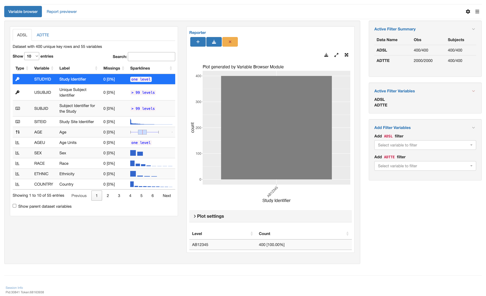

### Introduction

`teal` extends the `shiny` framework, enabling the creation of interactive GUI applications using the `R`.
`shiny`, and `teal`facilitate the development of extensive applications through combining small, decoupled modules.
The `teal.modules.general` package consist of collection of modules  essential for developing `teal` applications.
It is "general" in the sense that the intended functions of these modules are more fundamental. This contrasts with the more specialized focus on clinical data found in the `teal.modules.clinical` package.
The modules from `teal.modules.general`  can be used in conjunction with modules from `teal.modules.clinical` and / or
other `shiny` modules to build a large `teal` / `shiny` app.


The concepts presented here require knowledge about the core features of `teal`, specifically on how to launch a `teal`
application and how to pass data into it. Therefore, it is highly recommended to refer to the [`README`](https://insightsengineering.github.io/teal/index.html) file and
the introductory [vignette](https://insightsengineering.github.io/teal/latest-tag/articles/getting-started-with-teal.html) of the `teal` package.

See also `teal.modules.clinical`'s [`README`](https://insightsengineering.github.io/teal.modules.clinical/latest-tag/index.html).

### Main features

There are five areas of data science that `teal.modules.general` provides tools and solutions (modules) for:

- viewing data in tabular formats
- visualizing data in plots and graphs
- viewing data and files in a directory
- examining missing and extreme values in data
- performing data analysis

See [package functions / modules](https://insightsengineering.github.io/teal.modules.general/latest-tag/reference/index.html).

### Example application

A simple application featuring the `tm_variable_browser()` module:
```{r app, message = FALSE, results = "hide"}
# load libraries
library(teal.modules.general)
library(teal.widgets)
library(sparkline)

# teal_data object
data <- teal_data()
data <- within(data, {
  ADSL <- rADSL
  ADTTE <- rADTTE
})
datanames <- c("ADSL", "ADTTE")
datanames(data) <- datanames
join_keys(data) <- default_cdisc_join_keys[datanames]

# tm_variable_browser module
tm_variable_browser_module <- tm_variable_browser(
  label = "Variable browser",
  ggplot2_args = ggplot2_args(
    labs = list(subtitle = "Plot generated by Variable Browser Module")
  )
)

# initialize the app
app <- init(
  data = data,
  modules = modules(tm_variable_browser_module)
)
```

```{r shinyapp, eval = FALSE}
shinyApp(app$ui, app$server)
```



### Try it out in Shinylive

```{r shinylive_url, echo = FALSE, results = 'asis'}
code <- paste0(c(
  knitr::knit_code$get("app"),
  knitr::knit_code$get("shinyapp")
), collapse = "\n")

url <- roxy.shinylive::create_shinylive_url(code)
cat(sprintf("[Open in Shinylive](%s)\n\n", url))
```

```{r shinylive_iframe, echo = FALSE, out.width = '150%', eval = knitr::is_html_output() && requireNamespace("pkgdown", quietly = TRUE) && getFromNamespace("in_pkgdown", "pkgdown")()}
knitr::include_url(url, height = "800px")
```

Let's break the above app into pieces:

1: Load the necessary libraries and data.
```r
library(teal.modules.general)
library(teal.widgets)
```
2: Construct a `teal_data` object containing that will serve as the source of data for the `teal` app. `teal_data` not only encapsulates the data for the app, but it also houses the code required to create the data to maintain reproducibility.

To do this, we create an empty `teal_data` object and evaluate code to produce the data within the `teal_data` object, so both the code and data are stored together.

Following this, we set the `datanames` and `join_keys`.

```r
data <- teal_data()
data <- within(data, {
  ADSL <- rADSL
  ADTTE <- rADTTE
})
datanames <- c("ADSL", "ADTTE")
datanames(data) <- datanames
join_keys(data) <- default_cdisc_join_keys[datanames]
```

3: Initialize a `teal` application with specified data and modules, in this case, the module: `tm_variable_browser`, datasets:`ADSL` and `ADTTE`.

`shiny::shinyApp()` use the `ui` and `server` component to initialize the `teal` app.


```r
tm_variable_browser_module <- tm_variable_browser(
  # module name to display in the GUI
  label = "Variable browser",
  # this argument takes a set of arguments to pass to ggplot2.
  # the arguments must have the same names as its ggplot2 counterpart, e.g. `subtitle`
  ggplot2_args = ggplot2_args(
    labs = list(subtitle = "Plot generated by Variable Browser Module")
  )
)

app <- init(
  data = data,
  modules = modules(tm_variable_browser_module)
)

shinyApp(app$ui, app$server)
```

In a `teal` app, data and modules are decoupled. In the app above:

- The app developer specified the data and assigned it to the `data` argument.
- The app developer specified the module and assigned it to the `modules` argument.
- The `init` function took these arguments and returned a list containing `ui` and `server` object, which can be demonstrated by running:

```{r, indent = "     "}
class(app)
names(app)
```

