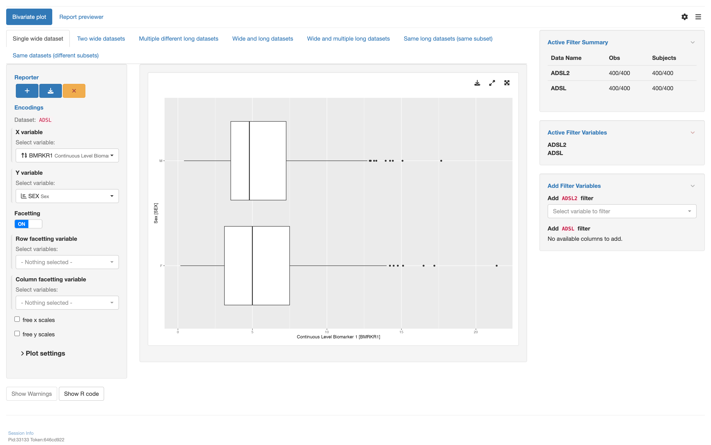

# `teal` application to use bivariate plot with various datasets types

This vignette will guide you through the four parts to create a `teal` application using
various types of datasets using the bivariate plot module `tm_g_bivariate()`:

1. Load libraries
2. Create data sets
3. Create an `app` variable
4. Run the app

## 1 - Load libraries

```{r library, echo=TRUE, message=FALSE, warning=FALSE, results="hide"}
library(teal.modules.general) # used to create the app
library(dplyr) # used to modify data sets
```


## 2 - Create data sets

Inside this app 4 datasets will be used

1. `ADSL` A wide data set with subject data
2. `ADRS` A long data set with response data for subjects at different time points of the study
3. `ADTTE` A long data set with time to event data
4. `ADLB` A long data set with lab measurements for each subject

```{r data, echo=TRUE, message=FALSE, warning=FALSE, results="hide"}
data <- teal_data()
data <- within(data, {
  ADSL <- teal.modules.general::rADSL %>%
    mutate(TRTDUR = round(as.numeric(TRTEDTM - TRTSDTM), 1))
  ADRS <- teal.modules.general::rADRS
  ADTTE <- teal.modules.general::rADTTE
  ADLB <- teal.modules.general::rADLB %>%
    mutate(CHGC = as.factor(case_when(
      CHG < 1 ~ "N",
      CHG > 1 ~ "P",
      TRUE ~ "-"
    )))
})
datanames <- c("ADSL", "ADRS", "ADTTE", "ADLB")
datanames(data) <- datanames
join_keys(data) <- default_cdisc_join_keys[datanames]
```

## 3 - Create an `app` variable

This is the most important section. We will use the `teal::init()` function to
create an app. The data will be handed over using `teal.data::teal_data()`. The app
itself will be constructed by multiple calls of `tm_g_bivariate()` using different
combinations of data sets.

```{r app, echo=TRUE, message=FALSE, warning=FALSE, results="hide"}
# configuration for the single wide dataset
mod1 <- tm_g_bivariate(
  label = "Single wide dataset",
  x = data_extract_spec(
    dataname = "ADSL",
    select = select_spec(
      label = "Select variable:",
      choices = variable_choices(data[["ADSL"]]),
      selected = "BMRKR1",
      fixed = FALSE
    )
  ),
  y = data_extract_spec(
    dataname = "ADSL",
    select = select_spec(
      label = "Select variable:",
      choices = variable_choices(data[["ADSL"]]),
      selected = "SEX",
      multiple = FALSE,
      fixed = FALSE
    )
  ),
  row_facet = data_extract_spec(
    dataname = "ADSL",
    select = select_spec(
      label = "Select variables:",
      choices = variable_choices(data[["ADSL"]]),
      selected = NULL,
      multiple = FALSE,
      fixed = FALSE
    )
  ),
  col_facet = data_extract_spec(
    dataname = "ADSL",
    select = select_spec(
      label = "Select variables:",
      choices = variable_choices(data[["ADSL"]]),
      selected = NULL,
      multiple = FALSE,
      fixed = FALSE
    )
  )
)

# configuration for the two wide datasets
mod2 <- tm_g_bivariate(
  label = "Two wide datasets",
  x = data_extract_spec(
    dataname = "ADSL",
    select = select_spec(
      label = "Select variable:",
      choices = variable_choices(data[["ADSL"]], c("BMRKR1", "AGE", "SEX", "STRATA1", "RACE")),
      selected = c("BMRKR1"),
      multiple = FALSE
    )
  ),
  y = data_extract_spec(
    dataname = "ADSL",
    select = select_spec(
      label = "Select variables:",
      choices = variable_choices(data[["ADSL"]], c("COUNTRY", "AGE", "RACE")),
      selected = "RACE",
      multiple = FALSE
    )
  ),
  row_facet = data_extract_spec(
    dataname = "ADSL",
    select = select_spec(
      label = "Select variable:",
      choices = variable_choices(data[["ADSL"]]),
      selected = NULL,
      multiple = FALSE,
      fixed = FALSE
    )
  ),
  col_facet = data_extract_spec(
    dataname = "ADSL",
    select = select_spec(
      label = "Select variables:",
      choices = variable_choices(data[["ADSL"]]),
      selected = NULL,
      multiple = FALSE,
      fixed = FALSE
    )
  )
)

# configuration for the multiple different long datasets
mod3 <- tm_g_bivariate(
  label = "Multiple different long datasets",
  x = data_extract_spec(
    dataname = "ADRS",
    filter = filter_spec(
      label = "Select endpoints:",
      vars = c("PARAMCD", "AVISIT"),
      choices = value_choices(data[["ADRS"]], c("PARAMCD", "AVISIT"), c("PARAM", "AVISIT")),
      selected = "OVRINV - END OF INDUCTION",
      multiple = TRUE
    ),
    select = select_spec(
      choices = variable_choices(data[["ADRS"]], c("AVALC", "AVAL")),
      selected = "AVALC",
      multiple = FALSE
    )
  ),
  y = data_extract_spec(
    dataname = "ADTTE",
    select = select_spec(
      label = "Select variable:",
      choices = variable_choices(data[["ADTTE"]], c("AVAL", "CNSR")),
      selected = "AVAL",
      multiple = FALSE,
      fixed = FALSE
    ),
    filter = filter_spec(
      label = "Select endpoint:",
      vars = c("PARAMCD"),
      choices = value_choices(data[["ADTTE"]], "PARAMCD", "PARAM"),
      selected = "OS",
      multiple = FALSE
    )
  ),
  row_facet = data_extract_spec(
    dataname = "ADRS",
    filter = filter_spec(
      label = "Select endpoints:",
      vars = c("PARAMCD", "AVISIT"),
      choices = value_choices(data[["ADRS"]], c("PARAMCD", "AVISIT"), c("PARAM", "AVISIT")),
      selected = "OVRINV - SCREENING",
      multiple = TRUE
    ),
    select = select_spec(
      label = "Select variable:",
      choices = variable_choices(data[["ADRS"]], c("SEX", "RACE", "COUNTRY", "ARM", "PARAMCD", "AVISIT")),
      selected = "SEX",
      multiple = FALSE,
      fixed = FALSE
    )
  ),
  col_facet = data_extract_spec(
    dataname = "ADSL",
    select = select_spec(
      label = "Select variables:",
      choices = variable_choices(data[["ADSL"]], c("SEX", "RACE")),
      selected = NULL,
      multiple = FALSE,
      fixed = FALSE
    )
  ),
  color_settings = TRUE,
  color = data_extract_spec(
    dataname = "ADSL",
    select = select_spec(
      choices = variable_choices(data[["ADSL"]], c("SEX", "RACE", "COUNTRY")),
      selected = NULL,
      multiple = FALSE,
      fixed = FALSE,
      label = "Select variable:"
    )
  ),
  fill = data_extract_spec(
    dataname = "ADSL",
    select = select_spec(
      choices = variable_choices(data[["ADSL"]], c("SEX", "RACE", "COUNTRY")),
      selected = NULL,
      multiple = FALSE,
      fixed = FALSE,
      label = "Select variable:"
    )
  ),
  size = data_extract_spec(
    dataname = "ADSL",
    select = select_spec(
      choices = variable_choices(data[["ADSL"]], c("AGE", "BMRKR1")),
      selected = NULL,
      multiple = FALSE,
      fixed = FALSE,
      label = "Select variable:"
    )
  ),
  plot_height = c(600, 200, 2000),
  ggtheme = "gray"
)

# configuration for the wide and long datasets
mod4 <- tm_g_bivariate(
  label = "Wide and long datasets",
  x = data_extract_spec(
    dataname = "ADRS",
    filter = list(
      filter_spec(
        vars = "PARAMCD",
        choices = value_choices(data[["ADRS"]], "PARAMCD", "PARAM"),
        selected = levels(data[["ADRS"]]$PARAMCD)[1],
        multiple = FALSE,
        label = "Select response:"
      ),
      filter_spec(
        vars = "AVISIT",
        choices = levels(data[["ADRS"]]$AVISIT),
        selected = levels(data[["ADRS"]]$AVISIT)[1],
        multiple = FALSE,
        label = "Select visit:"
      )
    ),
    select = select_spec(
      choices = variable_choices(data[["ADRS"]], c("AVALC", "AVAL")),
      selected = "AVALC",
      multiple = FALSE,
      label = "Select variable:"
    )
  ),
  y = data_extract_spec(
    dataname = "ADSL",
    select = select_spec(
      choices = variable_choices(data[["ADSL"]], c("BMRKR1", "SEX", "AGE", "RACE", "COUNTRY")),
      selected = "BMRKR1",
      multiple = FALSE,
      label = "Select variable:",
      fixed = FALSE
    )
  ),
  row_facet = data_extract_spec(
    dataname = "ADRS",
    select = select_spec(
      choices = variable_choices(data[["ADRS"]], c("SEX", "RACE", "ARMCD", "PARAMCD")),
      selected = "SEX",
      multiple = FALSE,
      label = "Select variable:"
    )
  ),
  col_facet = data_extract_spec(
    dataname = "ADRS",
    select = select_spec(
      choices = variable_choices(data[["ADRS"]], c("SEX", "RACE", "ARMCD", "PARAMCD", "AVISIT")),
      selected = "ARMCD",
      multiple = FALSE,
      fixed = FALSE,
      label = "Select variable:"
    )
  )
)

# configuration for the wide and multiple long datasets
mod5 <- tm_g_bivariate(
  label = "Wide and multiple long datasets",
  x = data_extract_spec(
    dataname = "ADRS",
    filter = list(
      filter_spec(
        vars = "PARAMCD",
        choices = value_choices(data[["ADRS"]], "PARAMCD", "PARAM"),
        selected = levels(data[["ADRS"]]$PARAMCD)[1],
        multiple = FALSE,
        label = "Select response:"
      ),
      filter_spec(
        vars = "AVISIT",
        choices = levels(data[["ADRS"]]$AVISIT),
        selected = levels(data[["ADRS"]]$AVISIT)[1],
        multiple = FALSE,
        label = "Select visit:"
      )
    ),
    select = select_spec(
      choices = variable_choices(data[["ADRS"]], c("AVALC", "AVAL")),
      selected = "AVALC",
      multiple = FALSE,
      label = "Select variable:"
    )
  ),
  y = data_extract_spec(
    dataname = "ADSL",
    select = select_spec(
      choices = variable_choices(data[["ADSL"]], c("BMRKR1", "SEX", "AGE", "RACE", "COUNTRY")),
      selected = "BMRKR1",
      multiple = FALSE,
      fixed = FALSE
    )
  ),
  row_facet = data_extract_spec(
    dataname = "ADLB",
    filter = list(
      filter_spec(
        vars = "PARAMCD",
        choices = value_choices(data[["ADLB"]], "PARAMCD", "PARAM"),
        selected = levels(data[["ADLB"]]$PARAMCD)[1],
        multiple = FALSE,
        label = "Select measurement:"
      ),
      filter_spec(
        vars = "AVISIT",
        choices = levels(data[["ADLB"]]$AVISIT),
        selected = levels(data[["ADLB"]]$AVISIT)[1],
        multiple = FALSE,
        label = "Select visit:"
      )
    ),
    select = select_spec(
      choices = "ARMCD",
      selected = NULL,
      multiple = FALSE,
      fixed = FALSE,
      label = "Select variable:"
    )
  ),
  col_facet = data_extract_spec(
    dataname = "ADSL",
    select = select_spec(
      choices = variable_choices(data[["ADSL"]], c("SEX", "AGE", "RACE", "COUNTRY")),
      selected = NULL,
      multiple = FALSE,
      fixed = FALSE,
      label = "Select variable:"
    )
  ),
  color_settings = TRUE,
  color = data_extract_spec(
    dataname = "ADSL",
    select = select_spec(
      choices = variable_choices(data[["ADSL"]], c("SEX", "RACE", "COUNTRY")),
      selected = NULL,
      multiple = FALSE,
      fixed = FALSE,
      label = "Select variable:"
    )
  ),
  fill = data_extract_spec(
    dataname = "ADSL",
    select = select_spec(
      choices = variable_choices(data[["ADSL"]], c("SEX", "RACE", "COUNTRY")),
      selected = NULL,
      multiple = FALSE,
      fixed = FALSE,
      label = "Select variable:"
    )
  ),
  size = data_extract_spec(
    dataname = "ADSL",
    select = select_spec(
      choices = variable_choices(data[["ADSL"]], c("AGE", "BMRKR1")),
      selected = NULL,
      multiple = FALSE,
      fixed = FALSE,
      label = "Select variable:"
    )
  ),
  plot_height = c(600, 200, 2000),
  ggtheme = "gray"
)

# Configuration for the same long datasets (same subset)
mod6 <- tm_g_bivariate(
  label = "Same long datasets (same subset)",
  x = data_extract_spec(
    dataname = "ADRS",
    select = select_spec(
      choices = variable_choices(data[["ADRS"]], c("AVALC", "AVAL")),
      selected = "AVALC",
      multiple = FALSE,
      fixed = FALSE,
      label = "Select variable:"
    )
  ),
  y = data_extract_spec(
    dataname = "ADRS",
    select = select_spec(
      choices = variable_choices(data[["ADRS"]], c("SEX", "RACE", "COUNTRY", "ARMCD", "BMRKR1", "BMRKR2")),
      selected = "BMRKR1",
      multiple = FALSE,
      fixed = FALSE,
      label = "Select variable:"
    )
  ),
  row_facet = data_extract_spec(
    dataname = "ADRS",
    select = select_spec(
      choices = variable_choices(data[["ADRS"]], c("AVISIT", "PARAMCD")),
      selected = "PARAMCD",
      multiple = FALSE,
      label = "Select variables:"
    )
  ),
  col_facet = data_extract_spec(
    dataname = "ADRS",
    select = select_spec(
      choices = variable_choices(data[["ADRS"]], c("AVISIT", "PARAMCD")),
      selected = "AVISIT",
      multiple = FALSE,
      label = "Select variables:"
    )
  )
)

# Configuration for the same datasets (different subsets)
mod7 <- tm_g_bivariate(
  label = "Same datasets (different subsets)",
  x = data_extract_spec(
    dataname = "ADLB",
    filter = list(
      filter_spec(
        vars = "PARAMCD",
        choices = value_choices(data[["ADLB"]], "PARAMCD", "PARAM"),
        selected = levels(data[["ADLB"]]$PARAMCD)[1],
        multiple = FALSE,
        label = "Select lab:"
      ),
      filter_spec(
        vars = "AVISIT",
        choices = levels(data[["ADLB"]]$AVISIT),
        selected = levels(data[["ADLB"]]$AVISIT)[1],
        multiple = FALSE,
        label = "Select visit:"
      )
    ),
    select = select_spec(
      choices = "AVAL",
      selected = "AVAL",
      multiple = FALSE,
      fixed = TRUE
    )
  ),
  y = data_extract_spec(
    dataname = "ADLB",
    filter = list(
      filter_spec(
        vars = "PARAMCD",
        choices = value_choices(data[["ADLB"]], "PARAMCD", "PARAM"),
        selected = levels(data[["ADLB"]]$PARAMCD)[1],
        multiple = FALSE,
        label = "Select lab:"
      ),
      filter_spec(
        vars = "AVISIT",
        choices = levels(data[["ADLB"]]$AVISIT),
        selected = levels(data[["ADLB"]]$AVISIT)[1],
        multiple = FALSE,
        label = "Select visit:"
      )
    ),
    select = select_spec(
      choices = "AVAL",
      selected = "AVAL",
      multiple = FALSE,
      fixed = TRUE
    )
  ),
  use_density = FALSE,
  row_facet = data_extract_spec(
    dataname = "ADLB",
    filter = list(
      filter_spec(
        vars = "PARAMCD",
        choices = value_choices(data[["ADLB"]], "PARAMCD", "PARAM"),
        selected = levels(data[["ADLB"]]$PARAMCD)[1],
        multiple = FALSE,
        label = "Select lab:"
      ),
      filter_spec(
        vars = "AVISIT",
        choices = levels(data[["ADLB"]]$AVISIT),
        selected = levels(data[["ADLB"]]$AVISIT)[1],
        multiple = FALSE,
        label = "Select category:"
      )
    ),
    select = select_spec(
      choices = variable_choices(data[["ADLB"]], c("RACE", "SEX", "ARMCD", "ACTARMCD")),
      selected = NULL,
      multiple = FALSE,
      fixed = FALSE,
      label = "Select variable:"
    )
  ),
  col_facet = data_extract_spec(
    dataname = "ADLB",
    filter = list(
      filter_spec(
        vars = "PARAMCD",
        choices = value_choices(data[["ADLB"]], "PARAMCD", "PARAM"),
        selected = levels(data[["ADLB"]]$PARAMCD)[1],
        multiple = FALSE,
        label = "Select lab:"
      ),
      filter_spec(
        vars = "AVISIT",
        choices = levels(data[["ADLB"]]$AVISIT),
        selected = levels(data[["ADLB"]]$AVISIT)[1],
        multiple = FALSE,
        label = "Select category:"
      )
    ),
    select = select_spec(
      choices = variable_choices(data[["ADLB"]], c("RACE", "SEX", "ARMCD", "ACTARMCD")),
      selected = "ARMCD",
      multiple = FALSE,
      fixed = FALSE,
      label = "Select variables:"
    )
  ),
  color_settings = TRUE,
  color = data_extract_spec(
    dataname = "ADSL",
    select = select_spec(
      choices = variable_choices(data[["ADSL"]], c("SEX", "RACE", "COUNTRY")),
      selected = NULL,
      multiple = FALSE,
      fixed = FALSE,
      label = "Select variable:"
    )
  ),
  fill = data_extract_spec(
    dataname = "ADSL",
    select = select_spec(
      choices = variable_choices(data[["ADSL"]], c("SEX", "RACE", "COUNTRY")),
      selected = NULL,
      multiple = FALSE,
      fixed = FALSE,
      label = "Select variable:"
    )
  ),
  size = data_extract_spec(
    dataname = "ADSL",
    select = select_spec(
      choices = variable_choices(data[["ADSL"]], c("AGE", "BMRKR1")),
      selected = NULL,
      multiple = FALSE,
      fixed = FALSE,
      label = "Select variable:"
    )
  ),
  plot_height = c(600, 200, 2000),
  ggtheme = "gray"
)

# initialize the app
app <- init(
  data = data,
  modules = modules(
    # tm_g_bivariate ------
    modules(
      label = "Bivariate plot",
      mod1,
      mod2,
      mod3,
      mod4,
      mod5,
      mod6,
      mod7
    )
  )
)
```


## 4 - Run the app

A simple `shiny::shinyApp()` call will let you run the app.
Note that app is only displayed when running this code inside an `R` session.

```{r shinyapp, echo=TRUE, results="hide", eval=base::interactive()}
shinyApp(app$ui, app$server, options = list(height = 1024, width = 1024))
```



```{r shinylive_section, echo = FALSE, results = 'asis'}
cat("## 5 - Try it out with Shinylive\n\n")
```

```{r shinylive, echo = FALSE, out.width='150%', eval = knitr::is_html_output()}
code <- paste0(c(
  knitr::knit_code$get("library"),
  knitr::knit_code$get("data"),
  knitr::knit_code$get("app"),
  knitr::knit_code$get("shinyapp")
), collapse = "\n")

url <- roxy.shinylive::create_shinylive_url(code)

knitr::include_url(url, height = "800px")
```
