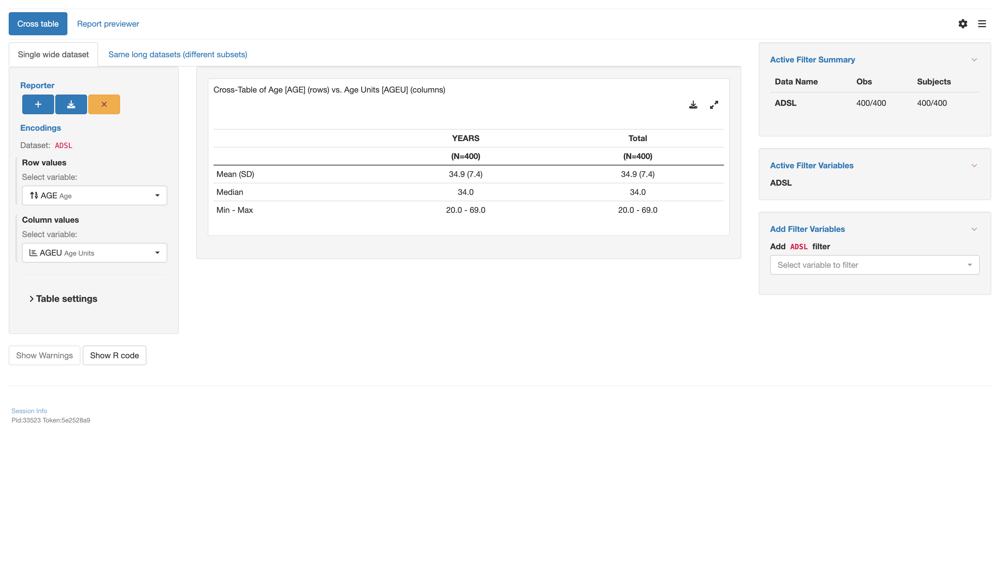

# `teal` application to use cross table with various datasets types

This vignette will guide you through the four parts to create a `teal` application using
various types of datasets using the cross table module `tm_t_crosstable()`:

1. Load libraries
2. Create data sets
3. Create an `app` variable
4. Run the app

## 1 - Load libraries

```{r echo=TRUE, message=FALSE, warning=FALSE, results="hide"}
library(teal.modules.general) # used to create the app
library(dplyr) # used to modify data sets
```

## 2 - Create data sets

Inside this app 2 datasets will be used

1. `ADSL` A wide data set with subject data
2. `ADLB` A long data set with lab measurements for each subject

```{r echo=TRUE, message=FALSE, warning=FALSE, results="hide", echo=2:6}
data <- teal_data()
data <- within(data, {
  ADSL <- teal.modules.general::rADSL
  ADLB <- teal.modules.general::rADLB %>%
    mutate(CHGC = as.factor(case_when(
      CHG < 1 ~ "N",
      CHG > 1 ~ "P",
      TRUE ~ "-"
    )))
})
datanames <- c("ADSL", "ADLB")
datanames(data) <- datanames
join_keys(data) <- default_cdisc_join_keys[datanames]
```

## 3 - Create an `app` variable

This is the most important section. We will use the `teal::init()` function to
create an app. The data will be handed over using `teal.data::teal_data()`. The app
itself will be constructed by multiple calls of `tm_t_crosstable()` using different
combinations of data sets.

```{r echo=TRUE, message=FALSE, warning=FALSE, results="hide"}
# configuration for the single wide dataset
mod1 <- tm_t_crosstable(
  label = "Single wide dataset",
  x = data_extract_spec(
    "ADSL",
    select = select_spec(
      label = "Select variable:",
      choices = variable_choices(data[["ADSL"]]),
      selected = names(data[["ADSL"]])[5],
      multiple = TRUE,
      fixed = FALSE,
      ordered = TRUE
    )
  ),
  y = data_extract_spec(
    "ADSL",
    select = select_spec(
      label = "Select variable:",
      choices = variable_choices(data[["ADSL"]]),
      selected = names(data[["ADSL"]])[6],
      multiple = FALSE,
      fixed = FALSE
    )
  )
)

# configuration for the same long datasets (different subsets)
mod2 <- tm_t_crosstable(
  label = "Same long datasets (different subsets)",
  x = data_extract_spec(
    dataname = "ADLB",
    filter = filter_spec(
      vars = "PARAMCD",
      choices = value_choices(data[["ADLB"]], "PARAMCD", "PARAM"),
      selected = levels(data[["ADLB"]]$PARAMCD)[1],
      multiple = FALSE
    ),
    select = select_spec(
      choices = variable_choices(data[["ADLB"]]),
      selected = "AVISIT",
      multiple = TRUE,
      fixed = FALSE,
      ordered = TRUE,
      label = "Select variable:"
    )
  ),
  y = data_extract_spec(
    dataname = "ADLB",
    filter = filter_spec(
      vars = "PARAMCD",
      choices = value_choices(data[["ADLB"]], "PARAMCD", "PARAM"),
      selected = levels(data[["ADLB"]]$PARAMCD)[1],
      multiple = FALSE
    ),
    select = select_spec(
      choices = variable_choices(data[["ADLB"]]),
      selected = "LOQFL",
      multiple = FALSE,
      fixed = FALSE,
      label = "Select variable:"
    )
  )
)

# initialize the app
app <- init(
  data = data,
  modules = modules(
    modules(
      label = "Cross table",
      mod1,
      mod2
    )
  )
)
```

## 4 - Run the app

A simple `shiny::shinyApp()` call will let you run the app.
Note that app is only displayed when running this code inside an `R` session.

```{r, echo=TRUE, results="hide", eval=base::interactive()}
shinyApp(app$ui, app$server, options = list(height = 1024, width = 1024))
```


