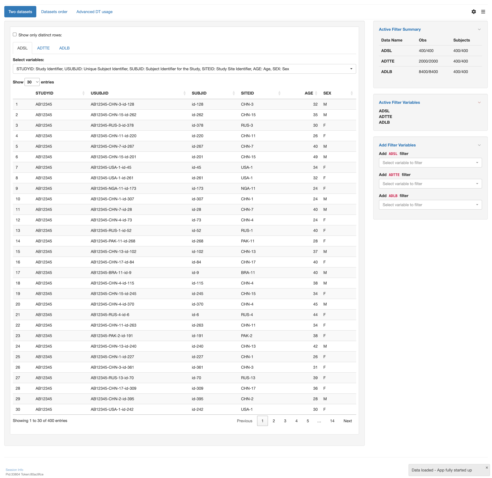

# `teal` application to display data table with various datasets types

This vignette will guide you through the four parts to create a `teal` application using
various types of datasets using the data table module `tm_data_table()`:

1. Load libraries
2. Create data sets
3. Create an `app` variable
4. Run the app

## 1 - Load libraries

```{r library, echo=TRUE, message=FALSE, warning=FALSE, results="hide"}
library(teal.modules.general) # used to create the app
```

## 2 - Create data sets

Inside this app 3 datasets will be used

1. `ADSL` A wide data set with subject data
2. `ADTTE` A long data set with time to event data
3. `ADLB` A long data set with lab measurements for each subject

```{r data, echo=TRUE, message=FALSE, warning=FALSE, results="hide"}
data <- teal_data()
data <- within(data, {
  ADSL <- teal.modules.general::rADSL
  ADTTE <- teal.modules.general::rADTTE
  ADLB <- teal.data::rADLB
})
join_keys(data) <- default_cdisc_join_keys[names(data)]
```

## 3 - Create an `app` variable

This is the most important section. We will use the `teal::init()` function to
create an app. The data will be handed over using `teal.data::teal_data()`.
The app itself will be constructed by multiple calls of `tm_data_table()` using different
combinations of data sets.

```{r app, echo=TRUE, message=FALSE, warning=FALSE, results="hide"}
# configuration for the two-datasets example
mod1 <- tm_data_table(
  label = "Two datasets",
  variables_selected = list(
    ADSL = c("STUDYID", "USUBJID", "SUBJID", "SITEID", "AGE", "SEX"),
    ADTTE = c(
      "STUDYID", "USUBJID", "SUBJID", "SITEID",
      "PARAM", "PARAMCD", "ARM", "ARMCD", "AVAL", "CNSR"
    )
  )
)

# configuration for the subsetting or changing order of datasets
mod2 <- tm_data_table(
  label = "Datasets order",
  variables_selected = list(
    ADSL = c("STUDYID", "USUBJID", "SUBJID", "SITEID", "AGE", "SEX"),
    ADLB = c(
      "STUDYID", "USUBJID", "SUBJID", "SITEID",
      "PARAM", "PARAMCD", "AVISIT", "AVISITN", "AVAL", "CHG"
    )
  ),
  datasets_selected = c("ADTTE", "ADLB", "ADSL")
)

# configuration for the advanced usage of DT options and extensions
mod3 <- tm_data_table(
  label = "Advanced DT usage",
  dt_args = list(extensions = c("Buttons", "ColReorder", "FixedHeader")),
  dt_options = list(
    searching = FALSE,
    pageLength = 30,
    lengthMenu = c(5, 15, 25, 50, 100),
    scrollX = FALSE,
    dom = "lBrtip",
    buttons = c("copy", "csv", "excel", "pdf", "print"),
    colReorder = TRUE,
    fixedHeader = TRUE
  )
)

# initialize the app
app <- init(
  data = data,
  modules = modules(
    mod1,
    mod2,
    mod3
  )
)
```

## 4 - Run the app

A simple `shiny::shinyApp()` call will let you run the app.
Note that app is only displayed when running this code inside an `R` session.

```{r shinyapp, echo=TRUE, results="hide", eval=base::interactive()}
shinyApp(app$ui, app$server, options = list(height = 1024, width = 1024))
```



## 5 - Try it out in Shinylive

```{r shinylive_url, echo = FALSE, results = 'asis', eval = requireNamespace("roxy.shinylive", quietly = TRUE)}
code <- paste0(c(
  knitr::knit_code$get("library"),
  knitr::knit_code$get("data"),
  knitr::knit_code$get("app"),
  knitr::knit_code$get("shinyapp")
), collapse = "\n")

url <- roxy.shinylive::create_shinylive_url(code)
cat(sprintf("[Open in Shinylive](%s)\n\n", url))
```

```{r shinylive_iframe, echo = FALSE, out.width = '150%', out.extra = 'style = "position: relative; z-index:1"', eval = requireNamespace("roxy.shinylive", quietly = TRUE) && knitr::is_html_output() && identical(Sys.getenv("IN_PKGDOWN"), "true")}
knitr::include_url(url, height = "800px")
```
