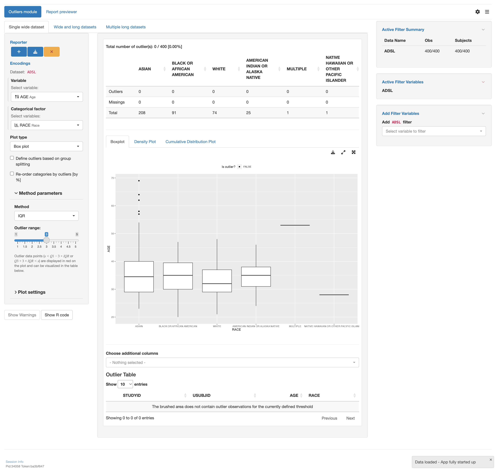

# `teal` application to analyze and report outliers with various datasets types.

This vignette will guide you through the four parts to create a `teal` application using
various types of datasets using the outliers module `tm_outliers()`:

1. Load libraries
2. Create data sets
3. Create an `app` variable
4. Run the app

## 1 - Load libraries

```{r library, echo=TRUE, message=FALSE, warning=FALSE, results="hide"}
library(teal.modules.general) # used to create the app
library(dplyr) # used to modify data sets
```

## 2 - Create data sets

Inside this app 3 datasets will be used

1. `ADSL` A wide data set with subject data
2. `ADRS` A long data set with response data for subjects at different time points of the study
3. `ADLB` A long data set with lab measurements for each subject

```{r data, echo=TRUE, message=FALSE, warning=FALSE, results="hide"}
data <- teal_data()
data <- within(data, {
  ADSL <- teal.modules.general::rADSL
  ADRS <- teal.modules.general::rADRS
  ADLB <- teal.modules.general::rADLB
})
datanames <- c("ADSL", "ADRS", "ADLB")
datanames(data) <- datanames
join_keys(data) <- default_cdisc_join_keys[datanames]
```

## 3 - Create an `app` variable

This is the most important section. We will use the `teal::init()` function to
create an app. The data will be handed over using `teal.data::teal_data()`. The app
itself will be constructed by multiple calls of `tm_outliers()` using different
combinations of data sets.

```{r app, echo=TRUE, message=FALSE, warning=FALSE, results="hide"}
# configuration for the single wide dataset
mod1 <- tm_outliers(
  label = "Single wide dataset",
  outlier_var = data_extract_spec(
    dataname = "ADSL",
    select = select_spec(
      label = "Select variable:",
      choices = variable_choices(data[["ADSL"]], c("AGE", "BMRKR1")),
      selected = "AGE",
      fixed = FALSE
    )
  ),
  categorical_var = data_extract_spec(
    dataname = "ADSL",
    select = select_spec(
      label = "Select variables:",
      choices = variable_choices(
        data[["ADSL"]],
        subset = names(Filter(isTRUE, sapply(data[["ADSL"]], is.factor)))
      ),
      selected = "RACE",
      multiple = FALSE,
      fixed = FALSE
    )
  )
)

# configuration for the wide and long datasets
mod2 <- tm_outliers(
  label = "Wide and long datasets",
  outlier_var = list(
    data_extract_spec(
      dataname = "ADSL",
      select = select_spec(
        label = "Select variable:",
        choices = variable_choices(data[["ADSL"]], c("AGE", "BMRKR1")),
        selected = "AGE",
        fixed = FALSE
      )
    ),
    data_extract_spec(
      dataname = "ADLB",
      select = select_spec(
        label = "Select variable:",
        choices = variable_choices(data[["ADLB"]], c("AVAL", "CHG2")),
        selected = "AVAL",
        multiple = FALSE,
        fixed = FALSE
      )
    )
  ),
  categorical_var =
    data_extract_spec(
      dataname = "ADSL",
      select = select_spec(
        label = "Select variables:",
        choices = variable_choices(
          data[["ADSL"]],
          subset = names(Filter(isTRUE, sapply(data[["ADSL"]], is.factor)))
        ),
        selected = "RACE",
        multiple = FALSE,
        fixed = FALSE
      )
    )
)

# configuration for the multiple long datasets
mod3 <- tm_outliers(
  label = "Multiple long datasets",
  outlier_var = list(
    data_extract_spec(
      dataname = "ADRS",
      select = select_spec(
        label = "Select variable:",
        choices = variable_choices(data[["ADRS"]], c("ADY", "EOSDY")),
        selected = "ADY",
        fixed = FALSE
      )
    ),
    data_extract_spec(
      dataname = "ADLB",
      select = select_spec(
        label = "Select variable:",
        choices = variable_choices(data[["ADLB"]], c("AVAL", "CHG2")),
        selected = "AVAL",
        multiple = FALSE,
        fixed = FALSE
      )
    )
  ),
  categorical_var = list(
    data_extract_spec(
      dataname = "ADRS",
      select = select_spec(
        label = "Select variables:",
        choices = variable_choices(data[["ADRS"]], c("ARM", "ACTARM")),
        selected = "ARM",
        multiple = FALSE,
        fixed = FALSE
      )
    ),
    data_extract_spec(
      dataname = "ADLB",
      select = select_spec(
        label = "Select variables:",
        choices = variable_choices(
          data[["ADLB"]],
          subset = names(Filter(isTRUE, sapply(data[["ADLB"]], is.factor)))
        ),
        selected = "RACE",
        multiple = FALSE,
        fixed = FALSE
      )
    )
  )
)

# initialize the app
app <- init(
  data = data,
  modules = modules(
    # tm_outliers ----
    modules(
      label = "Outliers module",
      mod1,
      mod2,
      mod3
    )
  )
)
```
## 4 - Run the app

A simple `shiny::shinyApp()` call will let you run the app.
Note that app is only displayed when running this code inside an `R` session.

```{r shinyapp, echo=TRUE, results="hide", eval=base::interactive()}
shinyApp(app$ui, app$server, options = list(height = 1024, width = 1024))
```



## 5 - Try it out in Shinylive

```{r shinylive_url, echo = FALSE, results = 'asis', eval = requireNamespace("roxy.shinylive", quietly = TRUE)}
code <- paste0(c(
  knitr::knit_code$get("library"),
  knitr::knit_code$get("data"),
  knitr::knit_code$get("app"),
  knitr::knit_code$get("shinyapp")
), collapse = "\n")

url <- roxy.shinylive::create_shinylive_url(code)
cat(sprintf("[Open in Shinylive](%s)\n\n", url))
```

```{r shinylive_iframe, echo = FALSE, out.width = '150%', out.extra = 'style = "position: relative; z-index:1"', eval = requireNamespace("roxy.shinylive", quietly = TRUE) && knitr::is_html_output() && identical(Sys.getenv("IN_PKGDOWN"), "true")}
knitr::include_url(url, height = "800px")
```
