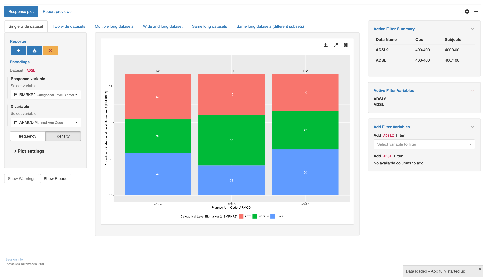

# `teal` application to use response plot with various datasets types

This vignette will guide you through the four parts to create a `teal` application using
various types of datasets using the response plot module `tm_g_response()`:

1. Load libraries
2. Create data sets
3. Create an `app` variable
4. Run the app

## 1 - Load libraries

```{r echo=TRUE, message=FALSE, warning=FALSE, results="hide"}
library(teal.modules.general) # used to create the app
library(dplyr) # used to modify data sets
```

## 2 - Create data sets

Inside this app 4 datasets will be used

1. `ADSL` A wide data set with subject data
2. `ADRS` A long data set with response data for subjects at different time points of the study
3. `ADTTE` A long data set with time to event data
4. `ADLB` A long data set with lab measurements for each subject

```{r echo=TRUE, message=FALSE, warning=FALSE, results="hide"}
data <- teal_data()
data <- within(data, {
  ADSL <- teal.modules.general::rADSL %>%
    mutate(TRTDUR = round(as.numeric(TRTEDTM - TRTSDTM), 1))
  ADRS <- teal.modules.general::rADRS
  ADTTE <- teal.modules.general::rADTTE
  ADLB <- teal.modules.general::rADLB %>%
    mutate(CHGC = as.factor(case_when(
      CHG < 1 ~ "N",
      CHG > 1 ~ "P",
      TRUE ~ "-"
    )))
})
datanames <- c("ADSL", "ADRS", "ADTTE", "ADLB")
datanames(data) <- datanames
join_keys(data) <- default_cdisc_join_keys[datanames]
```

## 3 - Create an `app` variable

This is the most important section. We will use the `teal::init()` function to
create an app. The data will be handed over using `teal.data::teal_data()`. The app
itself will be constructed by multiple calls of `tm_g_response()` using different
combinations of data sets.

```{r echo=TRUE, message=FALSE, warning=FALSE, results="hide"}
# configuration for the single wide dataset
mod1 <- tm_g_response(
  label = "Single wide dataset",
  response = data_extract_spec(
    dataname = "ADSL",
    select = select_spec(
      label = "Select variable:",
      choices = variable_choices(data[["ADSL"]], c("BMRKR2", "ITTFL", "BEP01FL")),
      selected = "BMRKR2",
      multiple = FALSE,
      fixed = FALSE
    )
  ),
  x = data_extract_spec(
    dataname = "ADSL",
    select = select_spec(
      label = "Select variable:",
      choices = variable_choices(data[["ADSL"]], c("SEX", "RACE", "COUNTRY", "ARMCD", "STRATA1")),
      selected = "ARMCD",
      multiple = FALSE,
      fixed = FALSE
    )
  )
)

# configuration for the two wide datasets
mod2 <- tm_g_response(
  label = "Two wide datasets",
  response = data_extract_spec(
    dataname = "ADSL",
    select = select_spec(
      label = "Select variable:",
      choices = variable_choices(data[["ADSL"]], c("BMRKR2", "ITTFL", "BEP01FL")),
      selected = "BMRKR2",
      multiple = FALSE
    )
  ),
  x = data_extract_spec(
    dataname = "ADSL",
    select = select_spec(
      label = "Select variable:",
      choices = c("SEX", "COUNTRY", "RACE", "STRATA1", "ARMCD"),
      selected = "ARMCD",
      multiple = FALSE
    )
  )
)

# configuration for the multiple long datasets
mod3 <- tm_g_response(
  label = "Multiple long datasets",
  response = data_extract_spec(
    dataname = "ADLB",
    filter = list(
      filter_spec(
        label = "Select parameter:",
        vars = "PARAMCD",
        choices = levels(data[["ADLB"]]$PARAMCD),
        selected = levels(data[["ADLB"]]$PARAMCD)[1],
        multiple = FALSE
      ),
      filter_spec(
        label = "Select visit:",
        vars = "AVISIT",
        choices = levels(data[["ADLB"]]$AVISIT),
        selected = levels(data[["ADLB"]]$AVISIT)[1],
        multiple = FALSE
      )
    ),
    select = select_spec(
      label = "Select variable:",
      choices = variable_choices(data[["ADLB"]], c("BMRKR2", "ITTFL", "BEP01FL")),
      selected = "BMRKR2",
      multiple = FALSE
    )
  ),
  x = data_extract_spec(
    dataname = "ADRS",
    filter = list(
      filter_spec(
        label = "Select parameter:",
        vars = "PARAMCD",
        choices = levels(data[["ADRS"]]$PARAMCD),
        selected = levels(data[["ADRS"]]$PARAMCD)[3],
        multiple = FALSE
      ),
      filter_spec(
        label = "Select visit:",
        vars = "AVISIT",
        choices = levels(data[["ADRS"]]$AVISIT),
        selected = levels(data[["ADRS"]]$AVISIT)[3],
        multiple = FALSE
      )
    ),
    select = select_spec(
      choices = c("AVALC", "ITTFL", "BEP01FL"),
      selected = "AVALC",
      multiple = FALSE,
      fixed = TRUE
    )
  ),
  row_facet = data_extract_spec(
    dataname = "ADSL",
    select = select_spec(
      label = "Select variable:",
      choices = "SEX",
      selected = NULL,
      multiple = FALSE
    )
  ),
  col_facet = data_extract_spec(
    dataname = "ADSL",
    select = select_spec(
      label = "Select variable:",
      choices = variable_choices(data[["ADSL"]], c("SEX", "COUNTRY")),
      selected = NULL,
      multiple = FALSE
    )
  )
)

# configuration for the wide and long dataset
mod4 <- tm_g_response(
  label = "Wide and long dataset",
  response = data_extract_spec(
    dataname = "ADLB",
    filter = list(
      filter_spec(
        vars = "PARAMCD",
        choices = levels(data[["ADLB"]]$PARAMCD),
        selected = levels(data[["ADLB"]]$PARAMCD)[2],
        multiple = TRUE,
        label = "Select measurement:"
      ),
      filter_spec(
        vars = "AVISIT",
        choices = levels(data[["ADLB"]]$AVISIT),
        selected = levels(data[["ADLB"]]$AVISIT)[2],
        multiple = TRUE,
        label = "Select visit:"
      )
    ),
    select = select_spec(
      choices = variable_choices(data[["ADLB"]], c("BMRKR2", "ITTFL", "BEP01FL")),
      selected = "BMRKR2",
      multiple = FALSE,
      fixed = FALSE,
      label = "Select variable:"
    )
  ),
  x = data_extract_spec(
    dataname = "ADSL",
    select = select_spec(
      choices = variable_choices(data[["ADSL"]], c("ARMCD", "BMRKR1", "BMRKR2", "BEP01FL")),
      selected = "BMRKR2",
      multiple = FALSE,
      fixed = FALSE
    )
  )
)

# configuration for the same long datasets (same subsets)
mod5 <- tm_g_response(
  label = "Same long datasets (same subsets)",
  response = data_extract_spec(
    dataname = "ADRS",
    select = select_spec(
      choices = variable_choices(data[["ADRS"]], c("BMRKR2", "AVALC", "BEP01FL")),
      selected = "AVALC",
      multiple = FALSE,
      fixed = TRUE,
      label = "Select variable:"
    )
  ),
  x = data_extract_spec(
    dataname = "ADRS",
    select = select_spec(
      choices = variable_choices(data[["ADRS"]], c("AVALC", "AGE", "SEX", "ARMCD", "STRATA1")),
      selected = "ARMCD",
      multiple = FALSE,
      fixed = FALSE,
      label = "Select variable:"
    )
  ),
  row_facet = data_extract_spec(
    dataname = "ADRS",
    select = select_spec(
      choices = "PARAMCD",
      selected = "PARAMCD",
      multiple = FALSE,
      fixed = FALSE,
      label = "Select variable:"
    )
  ),
  col_facet = data_extract_spec(
    dataname = "ADRS",
    select = select_spec(
      choices = "AVISIT",
      selected = "AVISIT",
      multiple = FALSE,
      fixed = FALSE,
      label = "Select variable:"
    )
  )
)

# configuration for the same long datasets (different subsets)
mod6 <- tm_g_response(
  label = "Same long datasets (different subsets)",
  response = data_extract_spec(
    dataname = "ADLB",
    filter = filter_spec(
      vars = "PARAMCD",
      choices = levels(data[["ADLB"]]$PARAMCD),
      selected = levels(data[["ADLB"]]$PARAMCD)[2],
      multiple = FALSE,
      label = "Select lab:"
    ),
    select = select_spec(
      choices = "BMRKR2",
      selected = "BMRKR2",
      multiple = FALSE,
      fixed = TRUE
    )
  ),
  x = data_extract_spec(
    dataname = "ADLB",
    filter = filter_spec(
      vars = "PARAMCD",
      choices = levels(data[["ADLB"]]$PARAMCD),
      selected = levels(data[["ADLB"]]$PARAMCD)[1],
      multiple = FALSE,
      label = "Select lab:"
    ),
    select = select_spec(
      choices = variable_choices(data[["ADLB"]], c("AVISIT", "PARAMCD", "BEP01FL")),
      selected = "AVISIT",
      multiple = FALSE,
      fixed = TRUE
    )
  ),
  row_facet = data_extract_spec(
    dataname = "ADLB",
    filter = list(
      filter_spec(
        vars = "PARAMCD",
        choices = levels(data[["ADLB"]]$PARAMCD),
        selected = levels(data[["ADLB"]]$PARAMCD)[1],
        multiple = FALSE,
        label = "Select lab:"
      ),
      filter_spec(
        vars = "AVISIT",
        choices = levels(data[["ADLB"]]$AVISIT),
        selected = levels(data[["ADLB"]]$AVISIT)[1],
        multiple = FALSE,
        label = "Select visit:"
      )
    ),
    select = select_spec(
      choices = variable_choices(data[["ADLB"]], c("SEX", "RACE", "ARMCD")),
      selected = NULL,
      multiple = FALSE,
      fixed = FALSE,
      label = "Select Variable"
    )
  ),
  col_facet = data_extract_spec(
    dataname = "ADLB",
    filter = list(
      filter_spec(
        vars = "PARAMCD",
        choices = levels(data[["ADLB"]]$PARAMCD),
        selected = levels(data[["ADLB"]]$PARAMCD)[1],
        multiple = FALSE,
        label = "Select lab:"
      ),
      filter_spec(
        vars = "AVISIT",
        choices = levels(data[["ADLB"]]$AVISIT),
        selected = levels(data[["ADLB"]]$AVISIT)[1],
        multiple = FALSE,
        label = "Select visit:"
      )
    ),
    select = select_spec(
      choices = variable_choices(data[["ADLB"]], c("SEX", "RACE", "ARMCD")),
      selected = NULL,
      multiple = FALSE,
      fixed = FALSE,
      label = "Select variable:"
    )
  )
)

# initialize the app
app <- init(
  data = data,
  modules = modules(
    modules(
      label = "Response plot",
      mod1,
      mod2,
      mod3,
      mod4,
      mod5,
      mod6
    )
  )
)
```

## 4 - Run the app

A simple `shiny::shinyApp()` call will let you run the app.
Note that app is only displayed when running this code inside an `R` session.

```{r, echo=TRUE, results="hide", eval=base::interactive()}
shinyApp(app$ui, app$server, options = list(height = 1024, width = 1024))
```


