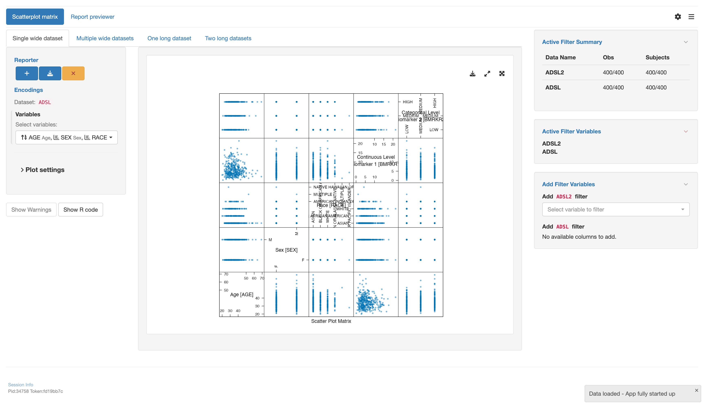

# `teal` application to use scatter plot matrix with various datasets types

This vignette will guide you through the four parts to create a `teal` application using
various types of datasets using the scatter plot matrix module `tm_g_scatterplotmatrix()`:

1. Load libraries
2. Create data sets
3. Create an `app` variable
4. Run the app

## 1 - Load libraries

```{r echo=TRUE, message=FALSE, warning=FALSE, results="hide"}
library(teal.modules.general) # used to create the app
library(dplyr) # used to modify data sets
```

## 2 - Create data sets

Inside this app 4 datasets will be used

1. `ADSL` A wide data set with subject data
2. `ADRS` A long data set with response data for subjects at different time points of the study
3. `ADTTE` A long data set with time to event data
4. `ADLB` A long data set with lab measurements for each subject

```{r echo=TRUE, message=FALSE, warning=FALSE, results="hide"}
data <- teal_data()
data <- within(data, {
  ADSL <- teal.modules.general::rADSL %>%
    mutate(TRTDUR = round(as.numeric(TRTEDTM - TRTSDTM), 1))
  ADRS <- teal.modules.general::rADRS
  ADTTE <- teal.modules.general::rADTTE
  ADLB <- teal.modules.general::rADLB %>%
    mutate(CHGC = as.factor(case_when(
      CHG < 1 ~ "N",
      CHG > 1 ~ "P",
      TRUE ~ "-"
    )))
})
datanames <- c("ADSL", "ADRS", "ADTTE", "ADLB")
datanames(data) <- datanames
join_keys(data) <- default_cdisc_join_keys[datanames]
```

## 3 - Create an `app` variable

This is the most important section. We will use the `teal::init()` function to
create an app. The data will be handed over using `teal.data::teal_data()`. The app
itself will be constructed by multiple calls of `tm_g_scatterplotmatrix()` using different
combinations of data sets.

```{r echo=TRUE, message=FALSE, warning=FALSE, results="hide"}
# configuration for the single wide dataset
mod1 <- tm_g_scatterplotmatrix(
  label = "Single wide dataset",
  variables = data_extract_spec(
    dataname = "ADSL",
    select = select_spec(
      label = "Select variables:",
      choices = variable_choices(data[["ADSL"]]),
      selected = c("AGE", "RACE", "SEX", "BMRKR1", "BMRKR2"),
      multiple = TRUE,
      fixed = FALSE,
      ordered = TRUE
    )
  )
)

# configuration for the one long datasets
mod2 <- tm_g_scatterplotmatrix(
  "One long dataset",
  variables = data_extract_spec(
    dataname = "ADTTE",
    select = select_spec(
      choices = variable_choices(data[["ADTTE"]], c("AVAL", "BMRKR1", "BMRKR2")),
      selected = c("AVAL", "BMRKR1", "BMRKR2"),
      multiple = TRUE,
      fixed = FALSE,
      ordered = TRUE,
      label = "Select variables:"
    )
  )
)

# configuration for the two long datasets
mod3 <- tm_g_scatterplotmatrix(
  label = "Two long datasets",
  variables = list(
    data_extract_spec(
      dataname = "ADRS",
      select = select_spec(
        label = "Select variables:",
        choices = variable_choices(data[["ADRS"]]),
        selected = c("AVAL", "AVALC"),
        multiple = TRUE,
        fixed = FALSE,
        ordered = TRUE,
      ),
      filter = filter_spec(
        label = "Select endpoints:",
        vars = c("PARAMCD", "AVISIT"),
        choices = value_choices(data[["ADRS"]], c("PARAMCD", "AVISIT"), c("PARAM", "AVISIT")),
        selected = "OVRINV - SCREENING",
        multiple = FALSE
      )
    ),
    data_extract_spec(
      dataname = "ADTTE",
      select = select_spec(
        label = "Select variables:",
        choices = variable_choices(data[["ADTTE"]]),
        selected = c("AVAL", "CNSR"),
        multiple = TRUE,
        fixed = FALSE,
        ordered = TRUE
      ),
      filter = filter_spec(
        label = "Select parameters:",
        vars = "PARAMCD",
        choices = value_choices(data[["ADTTE"]], "PARAMCD", "PARAM"),
        selected = "OS",
        multiple = TRUE
      )
    )
  )
)

# initialize the app
app <- init(
  data = data,
  modules = modules(
    modules(
      label = "Scatterplot matrix",
      mod1,
      mod2,
      mod3
    )
  )
)
```

## 4 - Run the app

A simple `shiny::shinyApp()` call will let you run the app.
Note that app is only displayed when running this code inside an `R` session.

```{r, echo=TRUE, results="hide", eval=base::interactive()}
shinyApp(app$ui, app$server, options = list(height = 1024, width = 1024))
```


